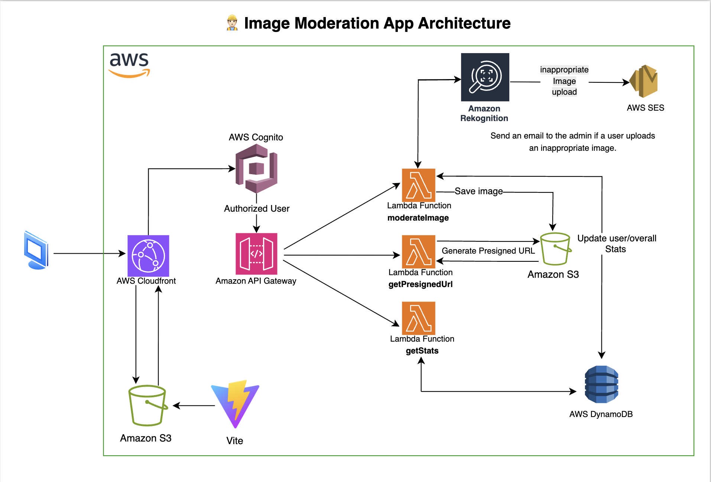

# 🖼️ Image Moderation App (Serverless)

A serverless web application that allows authenticated users to upload images, automatically detects inappropriate content using **Amazon Rekognition**, and stores analysis results in **DynamoDB**. Users are notified via **Amazon SES** if any content is flagged.

## 🛠️ Prerequisites

- **Node.js** v22.x
- **AWS CLI** (configured)
- **CDK v2** installed globally
  ```bash
  npm install -g aws-cdk
  ```

## 🚀 Features

- ✅ User authentication via **Amazon Cognito**
- ✅ Image uploads via **API Gateway + Lambda + S3**
- ✅ Automatic image moderation using **Amazon Rekognition**
- ✅ Flag tracking per user using **DynamoDB**
- ✅ Email alerts via **Amazon SES**
- ✅ Designed with cost-efficiency using **pay-per-request** models
- ✅ Automatic deletion of uploaded images after 24 hours via **S3 Lifecycle Rules**

## 📦 Tech Stack

### Backend

- [AWS CDK (TypeScript)](https://docs.aws.amazon.com/cdk/)
- [AWS Lambda](https://aws.amazon.com/lambda/)
- [Amazon S3](https://aws.amazon.com/s3/)
- [API Gateway](https://aws.amazon.com/api-gateway/)
- [AWS Rekognition](https://aws.amazon.com/rekognition/)
- [AWS SES](https://aws.amazon.com/ses/)
- [DynamoDB](https://aws.amazon.com/dynamodb/)

### Frontend

- [React](https://react.dev)
- [TypeScript](https://www.typescriptlang.org/)
- [Vite](https://vitejs.dev)
- [AWS Cognito](https://aws.amazon.com/cognito/) (for authentication)

## 🏗️ Architecture



---

## 🚀 Getting Started

### 1. Clone the Repo

```bash
git clone https://github.com/Bart-15/image-moderation-app.git
cd image-moderation-app
```

### 2. Set Up Backend

#### Install CDK Dependencies

```bash
cd cdk
npm install
```

#### Configure Environment Variables

Create a `.env` file inside the `cdk/` folder:

```env
SES_SENDER_EMAIL=you_ses_sender_email
NOTIFICATION_EMAIL=you_notification_email
AWS_REGION=aws_region
```

#### Deploy Infrastructure

```bash
# Bootstrap CDK (only needed once per AWS account/region)
cdk bootstrap

# Deploy all stacks
cdk deploy --all
```

> Note: Save the outputs from the CDK deployment - you'll need them for frontend configuration

### 3. Set Up Frontend

The frontend application is built with React and TypeScript, using Vite as the build tool.

#### Install Dependencies

```bash
# Navigate to client directory
cd client

# Install dependencies
npm install
```

#### Configure Environment Variables

Create a `.env` file in the `client/` directory:

```env
VITE_API_URL=your_api_gateway_url
VITE_USER_POOL_ID=your_cognito_user_pool_id
VITE_USER_POOL_CLIENT_ID=your_cognito_client_id
```

> These values come from your CDK deployment outputs

#### Development Server

```bash
npm run dev
```

The application will be available at `http://localhost:5173`

#### Production Build

```bash
# Create production build
npm run build

# Preview production build locally (optional)
npm run preview
```

## 🙋‍♂️ Author

Built by [Bart-15](https://github.com/Bart-15)  
**Software Engineer** | **AWS Certified Developer**
